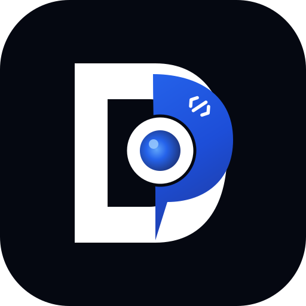

# DevCenterPoint Studio

<p align="center">
  
</p>

<p align="center">
  <strong>Custom Enterprise Engineering Studio, Cloud Architecture & Intelligent Systems</strong>
</p>

<p align="center">
  <a href="https://devcenterpoint.com"></a>
  <a href="https://devcenterpoint.ai.studio"></a>
  <a href="https://buildwithmushfiq.vercel.app"></a>
  <a href="https://github.com/beingmushfiq"></a>
</p>

<p align="center">
  
  
  
  
  
  
  
</p>

---

## 📌 Overview

**DevCenterPoint Studio** is the flagship engineering showcase, architecture catalog, and client engagement platform for **DevCenterPoint**—a custom software engineering firm founded by [Mushfiq](https://buildwithmushfiq.vercel.app).

Built with state-of-the-art web technologies (React 19, TypeScript, Tailwind CSS v4, Motion, and an accompanying Laravel 11 / Inertia CMS backend), the platform delivers a high-density, interactive experience featuring:

- **Liquid Glass & Atmospheric Light Aesthetic**: Ultra-modern frosted glassmorphism, dynamic floating liquid light orbs, neural canvas background, and dual light/dark themes.
- **Interactive Multi-App Client Sandbox**: 7 embedded, live interactive demo applications featuring custom simulated runtime states and live test workflows.
- **Omnichannel Headless CMS & Mission Control**: Full Laravel 11 Inertia admin command center with live visual preview cards, CRM lead management, and granular content controls.
- **Omnichannel Mobile-First Responsiveness**: 100% responsive from 320px (iPhone SE) to 4K displays with hybrid adaptive data views (touch cards on mobile, dense tables on desktop).
- **Verified Enterprise Deployments**: Real-time production systems accessible with evaluation credentials.
- **Global Command Palette**: Instant keyboard navigation (`Cmd+K` / `Ctrl+K`) with live system shortcuts and fuzzy search.
- **Custom Web Audio Synthesizer**: Zero-asset haptic acoustic micro-feedback engineered via the Web Audio API with tone presets (`ethereal`, `deep_tech`, `cyber`).

---

## 🚀 Live Enterprise Systems & Evaluation Portals

| Platform | Domain / URL | Category | Evaluation Credentials |
| :--- | :--- | :--- | :--- |
| **DevCenterPoint ERP & Storefront** | [demoerp.devcenterpoint.com](https://demoerp.devcenterpoint.com) | Omnichannel Commerce & ERP | User: `Admin`<br>Pass: `12345678` |
| **Feroza Medicine Corner Serial Manager** | [serial.ferozamedicinecorner.com](https://serial.ferozamedicinecorner.com) | Healthcare Counter & Queue OS | User: `Super Admin`<br>Pass: `12345678` |
| **Road Safety Movement** | [roadsafetymovement.org](https://roadsafetymovement.org) | Civic Org Management OS | Public Access / Production |
| **Qttenzy Smart Attendance** | [qttenzy.vercel.app](https://qttenzy.vercel.app) | Geofenced Dynamic QR Access | Live Evaluation |
| **DevCenterPoint AI Studio** | [devcenterpoint.ai.studio](https://devcenterpoint.ai.studio) | Applied AI & Automated Workflows | Public Research Hub |

---

## 🧪 Interactive Client Demo Sandbox (7 Live Applications)

The interactive sandbox modal provides immediate, hands-on simulation of seven flagship systems:

1. **DevCenterPoint ERP & POS**: Omnichannel retail ledger, inventory matrix, order tracking, and SKU dispatching.
2. **Healthcare Queue OS**: Patient check-in token management, live counter assignment, and real-time wait telemetry.
3. **Road Safety Movement OS**: Citizen incident dispatch, verification pipelines, and civic status updates.
4. **Qttenzy QR Attendance**: Real-time geofenced QR token regeneration and attendance check-in simulator.
5. **LeadLayer CRM Pipeline**: Inbound webhook payload inspection, qualification scoring, and lead dispatch.
6. **Fleet Logistics & Telemetry**: GPS vehicle coordinates, fuel consumption curves, and driver duty hours.
7. **Speech Therapy Assessment**: Pediatric clinical screening form, milestones assessment, and progress metrics.

---

## 🎛️ CMS & Mission Control Gateway

The platform includes a dedicated, responsive enterprise CMS built with Laravel 11 and Inertia.js React:

- **Mission Control Login Gateway** (`/login`): Atmospheric liquid glass auth interface with password reveal, ambient orb light fields, and a 1-click demo login helper (`admin@devcenterpoint.com` / `admin12345`).
- **Command Center Dashboard** (`/admin/dashboard`): Real-time system heartbeat, KPI statistics (Leads, Subscribers, Case Studies, Capabilities), and recent inquiry feeds.
- **Inquiries & Leads CRM** (`/admin/inquiries`): Stage Kanban pipeline, manual lead creator modal, stage progression triggers, and internal audit notes.
- **Hero & Atmosphere Studio** (`/admin/settings`): Live interactive preview card reflecting changes to hero badges, 2-line gradient headlines, thesis copy, and action CTAs in real time.
- **Dynamic Content Modules**: Full CRUD management for Projects, Capabilities, Team Members, FAQs, Testimonials, and Custom Sections.

---

## 🏛️ Architecture & Directory Structure

```text
DevCenterPoint-Studio/
├── src/                          # Standalone SPA Frontend (React 19 + TypeScript + Vite)
│   ├── components/               # UI Design System & Component Library
│   │   ├── ClientDemoSandboxModal.tsx  # 7-in-1 interactive sandbox application simulator
│   │   ├── CommandPalette.tsx    # Cmd+K fuzzy keyboard navigation
│   │   ├── Hero.tsx              # Liquid glass hero with animated light orbs & canvas
│   │   ├── Navigation.tsx        # Responsive desktop capsule & mobile drawer
│   │   ├── SelectedWorkSection.tsx # Flagship work cards + Prototype showcase
│   │   └── ...
│   ├── context/                  # Client React Context (Theme, Audio, CMS hydration)
│   ├── data/                     # Data stores & simulated databases
│   │   ├── projects.ts           # Case studies & live prototype registries
│   │   └── simulatedProjectDb.ts # Technical benchmarks, SLAs, and architecture flows
│   ├── lib/                      # Audio synthesizer, sound engine, and utilities
│   └── types.ts                  # Domain TypeScript interfaces
├── backend/                      # Laravel 11 + Inertia CMS & Admin Platform
│   ├── app/                      # Controllers, Models, Middleware, and Policies
│   ├── database/                 # Migrations & DatabaseSeeder with ecosystem data
│   ├── resources/js/             # Inertia React 19 Admin & Client components
│   │   ├── Components/           # Shared high-density components (1:1 parity with src/)
│   │   ├── Layouts/              # AdminLayout & GuestLayout shells
│   │   ├── Pages/                # Admin views (Dashboard, Inquiries, Settings, etc.)
│   │   └── lib/                  # Backend audio engine & client helpers
│   └── routes/                   # Web, API, and Authenticated Admin routes
└── docs/                         # Comprehensive engineering specs & implementation plans
```

---

## ⚡ Quickstart & Local Development

> **Which app is the real site?** This repo contains **two** React apps. Only one is deployed.
>
> | | Root (`src/`) | **`backend/` ← production** |
> | :--- | :--- | :--- |
> | Port | 3000 (`npm run dev`) | 8000 (Laravel) + 5173 (Vite HMR) |
> | Data | Hardcoded in `src/data/` | Database, editable via CMS |
> | CMS / admin | none | `/admin` |
> | Deployed by | nothing (design reference) | `.cpanel.yml` → `deploy/cpanel-deploy.sh` |
>
> `devcenterpoint.com` runs the **`backend/` Laravel + Inertia app**. The root `src/` app is a
> legacy standalone SPA kept as a **design reference only** — running it locally shows how the
> sections are meant to look, but it has no CMS. Always run the **`backend/`** app for real work.
> See [docs/CPANEL_DEPLOYMENT_GUIDE.md](docs/CPANEL_DEPLOYMENT_GUIDE.md) for the deployment details.

### Prerequisites

- **Node.js** `>= 20.x`
- **npm** or **bun**
- **PHP** `>= 8.2` & **Composer** *(Required for Laravel CMS backend)*

### 1. Running the Root Frontend (Vite + React 19) — design reference only

```bash
# Install frontend dependencies
npm install

# Start development server (port 3000)
npm run dev
```

The reference app will be live at `http://localhost:3000`.

### Available Scripts (Root)

| Command | Action |
| :--- | :--- |
| `npm run dev` | Launch local Vite development server with hot module replacement (HMR). |
| `npm run build` | Compile and bundle production assets to `dist/`. |
| `npm run preview` | Preview production build locally. |
| `npm run lint` | Run strict TypeScript compiler verification (`tsc --noEmit`). |

---

### 2. Running the Full-Stack Laravel Backend & CMS

**Prerequisites:** PHP 8.5+, Composer, Node.js 20+ and npm.

**First-time setup** (run once, from `backend/`):

```bash
cd backend

# Install PHP dependencies
composer install

# Install JS dependencies
npm install

# Setup environment
cp .env.example .env        # Windows PowerShell: Copy-Item .env.example .env
php artisan key:generate

# Create the SQLite database file (if missing) and run migrations + seed
php artisan migrate --seed  # seeds admin account, CMS content, appearance settings
```

**Run the app** — two terminals, both from `backend/`:

```bash
# Terminal 1 — Laravel (API + server-side rendering)
php artisan serve --host=127.0.0.1 --port=8000

# Terminal 2 — Vite dev server (HMR for React/Inertia assets)
npm run dev
```

> **Windows / CI note:** `laravel-vite-plugin` refuses to start the HMR server when it detects a
> CI-like environment and exits with *"You should not run the Vite HMR server in CI environments."*
> Bypass the guard for local development with:
>
> ```powershell
> $env:LARAVEL_BYPASS_ENV_CHECK=1; npm run dev
> ```
>
> On macOS/Linux: `LARAVEL_BYPASS_ENV_CHECK=1 npm run dev`

**Local endpoints**

| Service | URL |
| :--- | :--- |
| Frontend / Inertia App | `http://127.0.0.1:8000` |
| Mission Control Login | `http://127.0.0.1:8000/login` |
| Admin Dashboard | `http://127.0.0.1:8000/admin/dashboard` |
| Vite HMR server | `http://localhost:5173` |

**Database:** SQLite at `backend/database/database.sqlite` (`DB_CONNECTION=sqlite` in `.env`).
Migrations and seeders have already been run in this workspace.

**Default Admin Credentials** (verified via `Hash::check` against the seeded user):

- **Email**: `admin@devcenterpoint.com`
- **Password**: `admin12345`
- **Role**: `superadmin` (required to edit raw HTML/CSS/JS overrides under `/admin/appearance`)

#### Currently Running (verified)

Both dev servers are live and serving the app:

- **Laravel** — `http://127.0.0.1:8000` → `/login` returns `200` (HTML renders). Started with
  `php artisan serve --host=127.0.0.1 --port=8000`.
- **Vite** — `http://localhost:5173` → `/@vite/client` returns `200` and the `@vite/client` script is
  injected into the served HTML, so HMR is wired up. Started with
  `$env:LARAVEL_BYPASS_ENV_CHECK=1; npm run dev`.

To stop both servers, press <kbd>Ctrl</kbd> + <kbd>C</kbd> in each terminal.

---

## ⌨️ Command Palette Navigation

Press <kbd>Cmd</kbd> + <kbd>K</kbd> (Mac) or <kbd>Ctrl</kbd> + <kbd>K</kbd> (Windows/Linux) anywhere on the site to trigger the Command Palette:

- **`erp`** → Launch DevCenterPoint ERP Demo
- **`serial`** → Open Feroza Medicine Corner Serial Manager
- **`roadsafety`** → Open Road Safety Movement OS
- **`qttenzy`** → Open Qttenzy Attendance App
- **`ai`** → Open AI Studio
- **`mushfiq`** → Open Founder Portfolio & GitHub
- **`sound`** → Toggle audio synthesizer feedback

---

## 👤 Founder & Studio Inquiries

- **Founder**: Mushfiq ([buildwithmushfiq.vercel.app](https://buildwithmushfiq.vercel.app))
- **Engineering Studio**: [devcenterpoint.com](https://devcenterpoint.com)
- **Email Inquiries**: `contact@devcenterpoint.com`
- **GitHub**: [@beingmushfiq](https://github.com/beingmushfiq)

---

<p align="center">
  Made with precision by <strong>DevCenterPoint Studio</strong>. All rights reserved.
</p>
